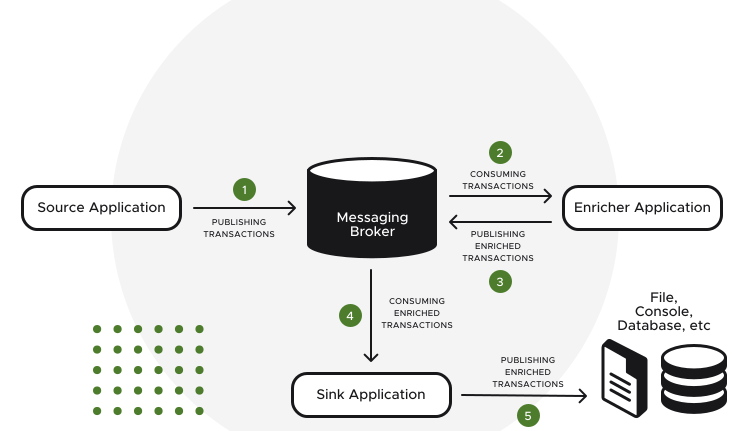

# Cashcard Application

### To create the image, run the following goal:

```
$ ./gradlew bootBuildImage
```

### To run everything in docker containers:

```
$ docker compose up -d --build
```

Or, you can run any of the applications individually like so:

```
$ docker run -p 8080:8080 cashcard-transaction-source:0.0.1-SNAPSHOT
$ docker run -p 8081:8080 cashcard-transaction-sink:0.0.1-SNAPSHOT
$ docker run -p 8082:8080 cashcard-transaction-enricher:0.0.1-SNAPSHOT
```

#### Make sure that your kafka broker instance is accessible to any of those docker images

### Executable with Native Build Tools
Use this option if you want to explore more options such as running your tests in a native image.
The GraalVM `native-image` compiler should be installed and configured on your machine.

NOTE: GraalVM 22.3+ is required.

To create the executable, run the following goal:

```
$ ./gradlew nativeCompile
```

Then, you can run the app as follows:
```
$ cashcard-transaction-source/build/native/nativeCompile/cashcard-transaction-source
$ cashcard-transaction-enricher/build/native/nativeCompile/cashcard-transaction-enricher
$ cashcard-transaction-sink/build/native/nativeCompile/cashcard-transaction-sink
```

You can also run your existing tests suite in a native image.
This is an efficient way to validate the compatibility of your application.

To run your existing tests in a native image, run the following goal:

```
$ ./gradlew nativeTest
```

### Gradle Toolchain support

There are some limitations regarding Native Build Tools and Gradle toolchains.
Native Build Tools disable toolchain support by default.
Effectively, native image compilation is done with the JDK used to execute Gradle.
You can read more about [toolchain support in the Native Build Tools here](https://graalvm.github.io/native-build-tools/latest/gradle-plugin.html#configuration-toolchains).


### Run applications without docker containers

1.  Start the source application: 

``` $ ./gradlew cashcard-transaction-source:bootRun ```

2. Start the enricher application:

``` $ ./gradlew cashcard-transaction-enricher:bootRun ```

3. Start the sink application:

``` $ ./gradlew cashcard-transaction-sink:bootRun ```

And finally, approved transactions should be logged in

``` cashcard-transaction-sink/build/tmp/transactions-output.csv ```

And if you want to run all applications locally without the native image

``` ./gradlew bootRun  ```

Also, to test all applications locally without native image

``` ./gradlew clean test ```

### Application's Endpoint URL: 

``` http://localhost:8080/pub ```

HTTP Method: ``` POST ```

Example Payload:

```
{
    "id": 1234,
    "cashCard": {
        "id": 12345,
        "owner": "testOwner",
        "amountRequestedForAuth": "3.14"
    }
}
```

### Architecture Overview




# TODO

- [ ] Add CI/CD Pipeline
